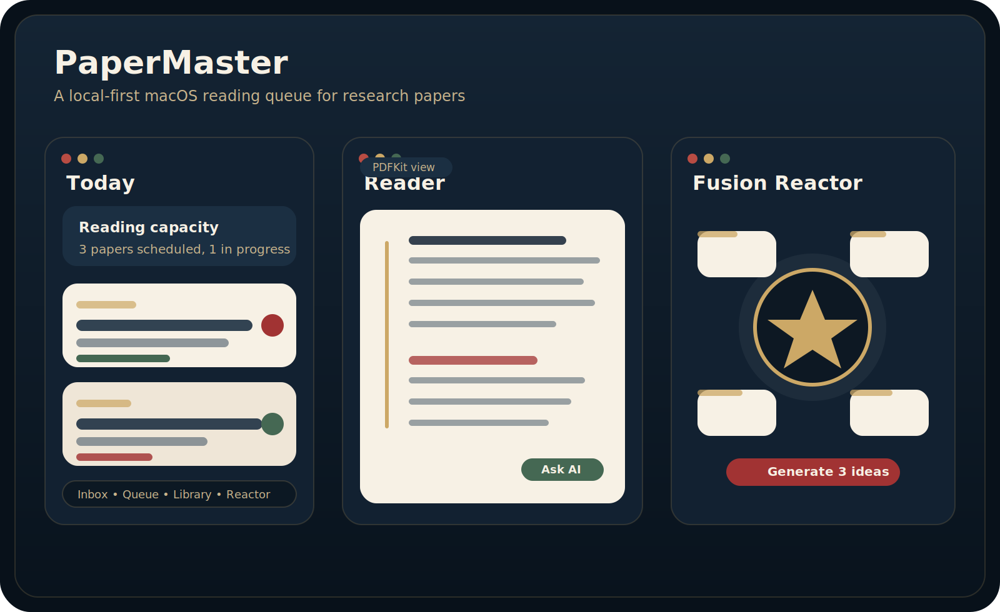
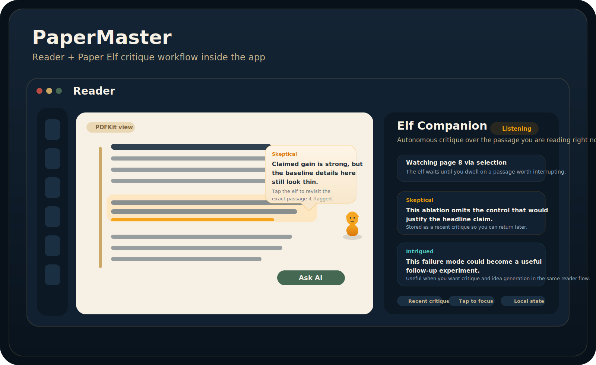
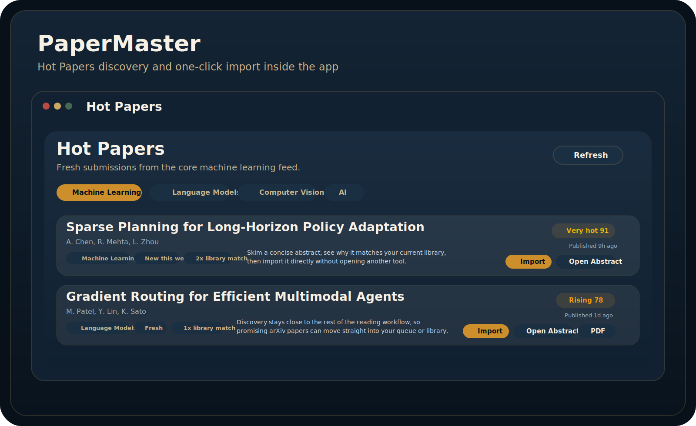
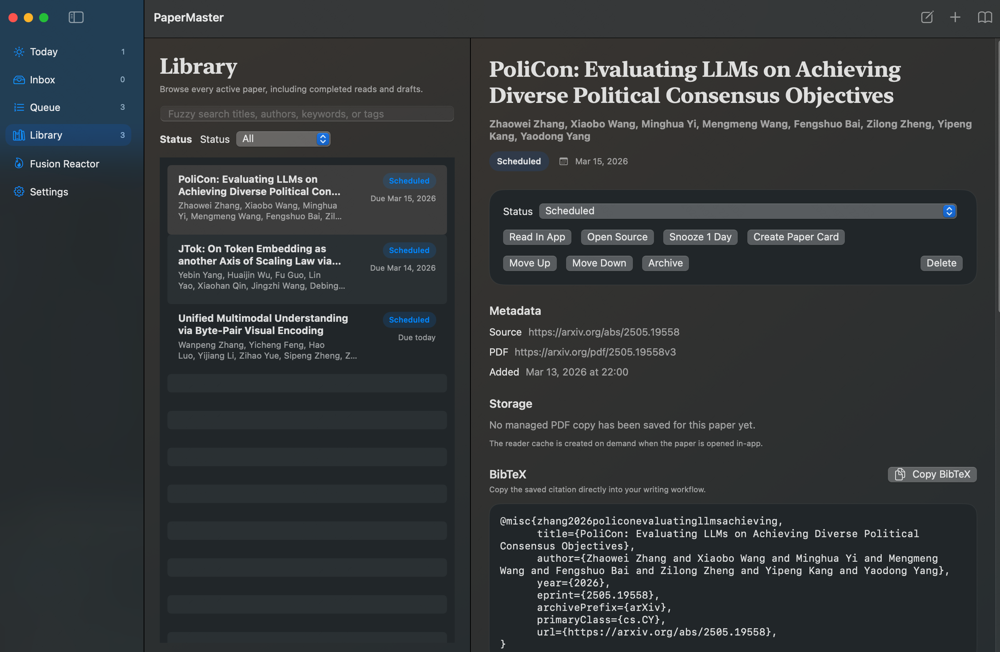
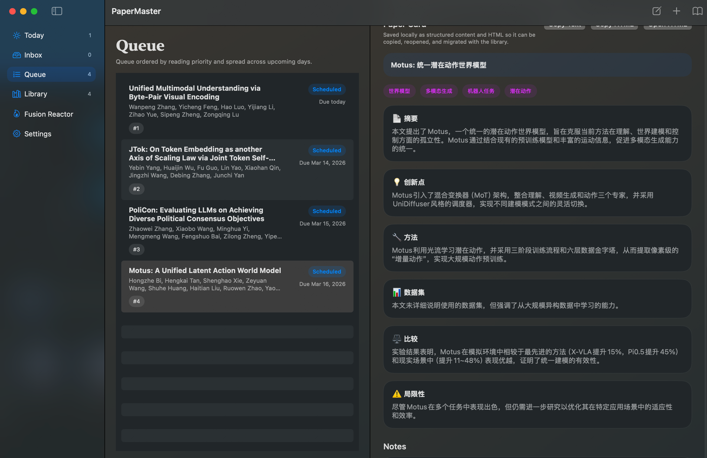
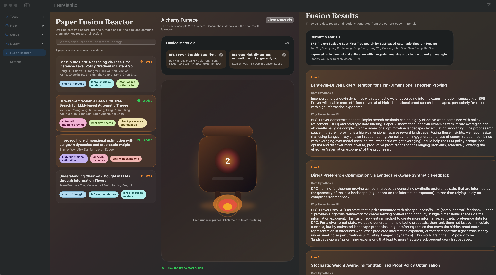

<p align="center">
  
</p>

<h1 align="center">PaperMaster</h1>

<p align="center">
  The first paper reading tool built to bring agents directly into the reading loop, so your information gathering, triage, and follow-up work can be automated instead of manually stitched together.
</p>

<p align="center">
  
</p>

PaperMaster is a native macOS paper reading workspace for collecting papers, storing PDFs, scheduling what to read next, fusing papers into new research ideas, and reviewing PDFs without leaving the app.

It is designed around a stronger idea than a normal paper manager: agents should not live outside your reading workflow. PaperMaster brings agent access directly into the app so local tools like `codex` can help accelerate literature discovery, triage, note-taking, queue planning, and other high-friction information tasks from the same workspace where you actually read.

The app is built with `SwiftUI`, `SwiftData`, `PDFKit`, and `UserNotifications`.

## Screenshot Tour

<table>
  <tr>
    <td width="50%" valign="top">
      
      <strong>Reader + Paper Elf</strong><br />
      Keep reading inside the app while the `Paper Elf` watches the current passage, surfaces critiques at the right moment, and keeps recent comments attached to your reader workflow.
    </td>
    <td width="50%" valign="top">
      
      <strong>Hot Papers</strong><br />
      Refresh a category, rank new arXiv submissions against your existing library signals, and pull promising work into PaperMaster before it disappears from your radar.
    </td>
  </tr>
  <tr>
    <td width="50%" valign="top">
      
      <strong>Library + paper detail</strong><br />
      Search by title, author, keyword, or tag, then jump straight into metadata, BibTeX, PDFs, and reusable `Paper Card` generation from the same view.
    </td>
    <td width="50%" valign="top">
      
      <strong>Today + Queue + Paper Cards</strong><br />
      Keep a realistic reading queue on the left while the right side turns each important paper into a polished, high-signal brief you can revisit later.
    </td>
  </tr>
  <tr>
    <td colspan="2" valign="top">
      
      <strong>Fusion Reactor</strong><br />
      Load a handful of papers, inspect the source material, and generate fresh research directions without leaving your local paper workspace.
    </td>
  </tr>
</table>

## UI Preview

The preview above highlights the app's main workflow:

- `Today`: prioritize what to read now based on your queue and reading capacity.
- `Reader`: review PDFs in-app and keep your reading flow inside the app.
- `Fusion Reactor`: combine papers into new idea prompts with an optional OpenAI-compatible backend.

The screenshots below show how that translates into daily utility inside the app.

The `Reader` screen now also shows where PaperMaster starts behaving less like a passive PDF viewer. `Paper Elf` acts as an in-context critique companion: it watches the passage you are dwelling on, interrupts when it spots a weak comparison or interesting claim, and keeps those comments in the same reading workspace.

<p align="center">
  
</p>

The `Hot Papers` screen keeps discovery inside the same workspace as the rest of your reading queue. Instead of browsing arXiv in a separate tab and manually triaging later, you can refresh a category, see why a paper is relevant to your current library, and import it immediately when it looks worth tracking.

<p align="center">
  
</p>

The `Library` and paper detail flow keeps fuzzy search, local paper browsing, PDF access, BibTeX, and `Paper Card` generation in one place:

<p align="center">
  
</p>

That makes the `Library` screen more than a storage list: it becomes the place where you can validate a paper quickly, inspect the metadata quality, reopen the PDF, copy citation material, and decide whether the paper deserves a richer summary artifact.

The `Queue` view highlights one of PaperMaster's strongest features: exceptionally high-quality `Paper Cards`. Instead of a thin AI summary, the card is designed to feel like a polished research artifact that is worth saving, reviewing, copying, and reusing later. It turns a paper into a clean, structured, high-signal brief with strong readability, obvious sectioning, and enough substance to be genuinely useful during follow-up work.

This makes the `Paper Card` workflow especially valuable for serious reading: scheduled papers stay visible on the left, while the right side becomes a refined knowledge panel that helps you recall the core idea, contributions, methods, comparisons, and limitations quickly without digging back through the PDF:

<p align="center">
  
</p>

Below is the actual `Fusion Reactor` screen running in the app, including loaded papers, the furnace interaction, and generated idea cards. This is where PaperMaster shifts from paper management into idea generation: the app keeps the source papers, the prompt surface, and the resulting concept cards in one place so synthesis work is easier to repeat and refine.

<p align="center">
  
</p>

## What The App Does

- Bring a real integrated terminal into the app so you can launch local agents like `codex` directly inside your paper reading workflow.
- Position PaperMaster as an `agent-native` reading tool instead of a passive paper archive.
- Give you one workspace where reading, summarizing, tagging, planning, and agent-driven follow-up can happen together.
- Import papers from arXiv abstract URLs, arXiv PDF URLs, direct PDF URLs, or manual metadata entry.
- Import local PDFs by dragging them directly onto the app window.
- Show a drop-target import UI when PDFs are dragged over the app.
- Extract metadata from local PDFs when possible, then enrich it with arXiv and Crossref when identifiable metadata is available.
- Resolve arXiv metadata automatically and infer fallback metadata from direct PDF links.
- Enrich imported papers with venue, DOI, and BibTeX data through Crossref when possible.
- Avoid duplicate imports by matching normalized paper identity URLs.
- Store managed PDF copies during import in the default app folder, a custom local folder, or a remote SSH target.
- Rename imported local PDFs into a managed, stable filename format.
- Watch the active local paper storage folder and auto-import newly copied PDFs.
- Bulk-import an existing local paper folder by selecting it as the storage directory, then letting PaperMaster scan and ingest the contained PDFs.
- Keep a queue of `scheduled` and `reading` papers based on your `papers/day` capacity.
- Show dedicated `Today`, `Inbox`, `Queue`, `Library`, `Hot Papers`, `Fusion Reactor`, and `Settings` screens.
- Reorder queued papers, snooze papers by a day, and move items across `inbox`, `scheduled`, `reading`, `done`, and `archived`.
- Read PDFs in-app with `PDFKit`, preferring managed or cached copies when available.
- Run the `Paper Elf` inside the reader so the current passage can trigger autonomous critique without leaving the PDF workflow.
- Discover recent arXiv submissions in `Hot Papers`, score them against your library signals, and import promising ones in one click.
- Browse the library with fuzzy search across titles, authors, keywords, and tags.
- Generate a structured AI `Paper Card` from the paper detail view, save it locally, copy it as text or HTML, and open the HTML export in a browser.
- Schedule native macOS notifications for the daily summary and for due or overdue papers.
- Generate topic tags during import with an optional OpenAI-compatible AI provider.
- Combine 2 to 6 papers in the `Fusion Reactor` screen by dragging them into the furnace and clicking the fire to request 3 fused research ideas from the backend AI.
- Store feedback entries locally with the current screen and selected paper context, then export them to the clipboard.

## Why Agent-Native Matters

Most paper tools stop at storage, annotation, or chat. PaperMaster is being built around a different workflow assumption: the fastest way to increase research throughput is to let agents operate inside the paper reading environment itself.

That means the long-term goal is not just "ask AI about a PDF." It is:

- let an agent research a topic and bring relevant papers into your library
- let an agent summarize findings directly into notes
- let an agent create or refine tags
- let an agent reorganize the reading queue based on your goals
- let an agent reduce the mechanical work required to stay on top of fast-moving literature

In short, PaperMaster is meant to increase your information acquisition speed by making paper reading programmable.

## Local-First Behavior

- Core paper data is stored locally with `SwiftData`.
- Cached PDFs are stored locally on disk.
- Managed PDFs can be stored locally or copied to a configured remote SSH destination.
- Generated `Paper Cards` are stored locally as structured app data, so they migrate with the main PaperMaster library.
- `Paper Card` HTML exports are written locally and can be reopened in a browser without re-querying the AI provider.
- Feedback entries stay local until you copy them out manually.
- AI provider API keys are stored in the macOS Keychain.
- Network access is only used for metadata lookup, Crossref enrichment, PDF downloads, remote SSH paper storage, and optional AI calls for tagging, `Paper Card` generation, and fusion.

## Requirements

- macOS 14 or later.
- Xcode Command Line Tools with a working `swift` executable at `/Library/Developer/CommandLineTools/usr/bin/swift`.
- Internet access if you want arXiv metadata lookup, Crossref enrichment, remote PDF caching, remote SSH paper storage, AI auto-tagging, AI `Paper Card` generation, or Fusion Reactor ideas.

The standalone app bundle script currently copies the built binary from `.build/arm64-apple-macosx/...`, so that flow is written for Apple Silicon builds.

## Latest Build Notice

If you want the latest features in this repository, build the app from source. Prebuilt copies can lag behind the current `main` branch, so the README documents the source version first.

That especially applies to newer workflows such as local PDF drag-and-drop import, storage-folder auto-ingest, and AI-generated `Paper Cards`.

## Build The App Bundle

From the project root:

```bash
./Scripts/build-app.sh release
```

This generates:

```text
dist/PaperMaster.app
```

For a debug bundle:

```bash
./Scripts/build-app.sh debug
```

## Development

Open `Package.swift` in Xcode if you want the normal macOS app debugging workflow.

Common commands from the project root:

```bash
./Scripts/swift-overlay.sh test
./Scripts/swift-overlay.sh run PaperMaster
```

The overlay script exists so builds and tests can still run when the local Swift macro host trust chain is broken. `build-app.sh` uses the same overlay automatically.

## Codex In PaperMaster

When you open the integrated terminal inside PaperMaster and start `codex`, the app now bootstraps a workspace-level `AGENTS.md` plus a built-in skill called `papermaster-agent-ops`.

This skill is meant to make PaperMaster actions more direct:

- If you ask Codex to import a paper and provide a PDF URL, arXiv URL, or local PDF path, it should prefer the shortest executable path instead of extended reasoning.
- For local paper storage setups, PaperMaster watches `PAPERMASTER_AGENT_IMPORT_DIR` and auto-imports PDFs placed there by the agent.
- The terminal session also exposes `PAPERMASTER_AGENT_WORKSPACE`, `PAPERMASTER_AGENT_IMPORT_DIR`, `PAPERMASTER_AGENT_EXPORTS_DIR`, and `PAPERMASTER_AGENT_SKILLS_DIR`.

Typical usage inside the PaperMaster terminal:

```text
codex
```

Then ask naturally:

```text
Import this paper into PaperMaster: https://arxiv.org/abs/2505.13308
```

Or invoke the skill explicitly:

```text
Use papermaster-agent-ops to import this paper into PaperMaster: /path/to/your/paper.pdf
```

In the fast path, Codex should download or copy the PDF into `PAPERMASTER_AGENT_IMPORT_DIR`; PaperMaster then ingests it automatically.

## Shared AI Provider Setup

The app uses one OpenAI-compatible provider setup for `Fusion Reactor`, `Paper Card` generation, and optional import auto-tagging.

1. Open `Settings`.
2. Set the provider `Base URL`.
3. Set the `Model` name.
4. Save the API key to Keychain.
5. Enable `Automatically generate tags on import` if you want new imports tagged automatically.
6. Open a paper detail view and click `Create Paper Card` if you want a reusable structured summary card plus HTML export.
7. Open `Fusion Reactor`, drag 2 to 6 papers into the furnace, and click the fire to start fusion.

Defaults:

- Base URL: `https://api.openai.com/v1`
- Model: `gpt-4o-mini`

The tagger expects an OpenAI-compatible `chat/completions` API.

## Project Layout

- `Sources/PaperMaster/Models`: `SwiftData` models and enums such as `Paper`, `Tag`, `UserSettings`, and app navigation types.
- `Sources/PaperMaster/Services`: metadata resolution, Crossref enrichment, import, paper storage, `Paper Card` generation and HTML export, scheduling, tagging, fusion, reminders, PDF caching, and credential storage.
- `Sources/PaperMaster/Views`: the macOS UI, including the import sheet, reader, paper detail view, `Paper Card` actions, fusion reactor, settings, and feedback capture flow.
- `Sources/PaperMaster/App`: app bootstrap, dependency wiring, and routing.
- `Tests/PaperMasterTests`: unit tests for import, scheduling, metadata resolution, enrichment, reminders, tagging, feedback, and app services.
- `Scripts/build-app.sh`: builds a standalone `.app` bundle in `dist/`.
- `Scripts/swift-overlay.sh`: runs Swift commands with the local toolchain overlay used by this repo.
